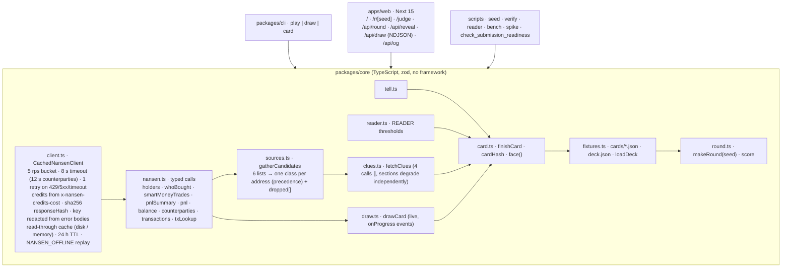

# ARCHITECTURE — Label Me (as shipped, 2026-09-18)

## One engine, three views

## Data flow

1. **Deck build** (`scripts/seed.ts`, once, live): `gatherCandidates` pulls, per token (PEPE, SHIB, LINK, UNI, MOG, TURBO), the Smart Money / Exchange / Public Figure holder lists, the plain top-100 page and the label-excluded buyers page, plus the live Smart Money trade feed once; resolves one class per address by the precedence in `docs/RULES.md`; for exchange/contract candidates asks the 1-credit tx-lookup for an entity label (which outranks the tag); runs the four clue calls; writes one fixture per card with every raw response byte-for-byte, and `deck.json` with the `deckHash`. Smart Money cards with < 5 trades are dropped; the dropped list is committed.
2. **Play** (0 network): `loadDeck` reads `fixtures/cards/`; `makeRound(seed)` picks ten (two per class) from a sha256 stream keyed on the seed. The web serves faces (`clues` + `cardHash` only) from `/api/round` and answers from `/api/reveal` after a guess; the CLI prints the same round; both compute the house rule with `read()`.
3. **Draw fresh** (live): `/api/draw` (POST) → guard → `drawCard`: a class (random or chosen), one sourcing page (Smart Money from the live feed, exchanges from the exchange list, whales from the label-excluded page, pools from WETH's holders, regulars from the excluded buyers), one unseen address, four clue calls — every call emitted as an NDJSON row the moment it lands, then the card, then the house read. Up to three sourcing pages before an honest error; past the daily ceiling a deck card is dealt with a `replay` notice.

## Verification

- `npm run verify` — every card replayed with `NANSEN_OFFLINE=1` from its own recorded responses; asserts `cardHash`, the clue/tell projection, exactly 4 calls, 0 network, 0 credits, no key in the file; `deck.json` matches the files. `--update` rebuilds cards from the untouched responses after an output-only change.
- `npm run reader` — accuracy + confusion matrix of the house rule on the deck.
- `npm run bench` — N live draws, cold/warm p50/p95, credits and calls per draw, out-of-sample house accuracy → `docs/BENCH.md`.
- `npm test` — 96 vitest tests: client (retry, timeout, header credits, redaction, rate limit), cache (keys, TTL 0, offline), classes, clue extraction, tell, reader, card hash/projection/face, round determinism and balance, sourcing precedence, draw events and fallbacks, fixture round-trip, the committed deck's invariants, and 6 fast-check properties × 2,000 runs.

## Web

Next.js 15 app router, one client component (`Game.tsx`) driving idle → play → done and the draw stream; server components deal from the deck. `lib/guard.ts` bounds spend (4 draws/min/IP, 600 credits/day/instance); `lib/deck.ts` loads the fixtures once per instance (`outputFileTracingIncludes` ships them to the function); `lib/site.ts` holds the canonical URL. Family design system from the sibling entries (tokens, shell, chips, cards); system font stack, no CDN on camera.

## Residual risks

- Vercel runs several instances: the guard's counters are per instance (a ceiling, not accounting) and the memory cache does not survive a cold start — a live draw on a cold instance is fully live (2–3 s).
- Nansen latency swings by the minute; the recording's default round never touches the network.
- The deck is a 30-day snapshot recorded 2026-09-18; re-running `seed` changes cards (and hashes) — the recording's round is pinned by `deckHash`.
