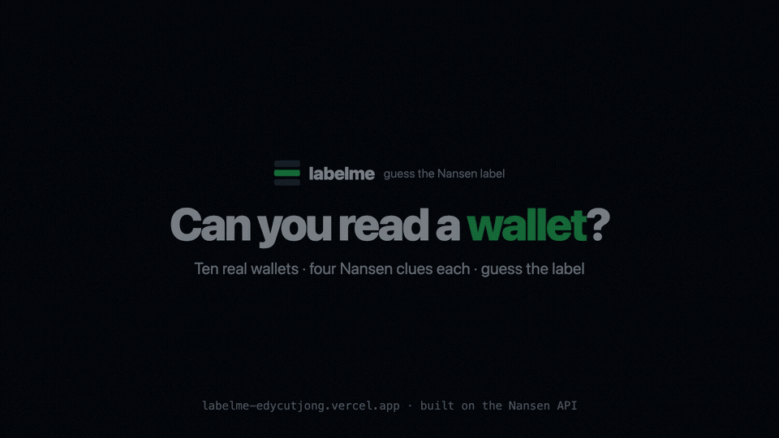
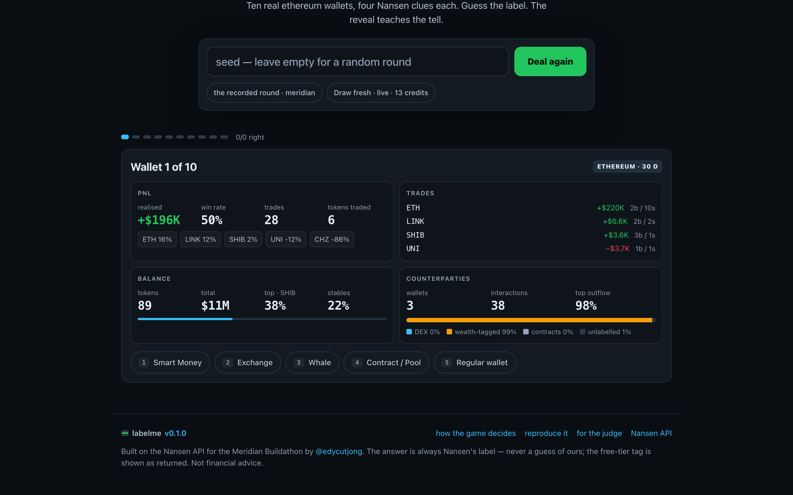
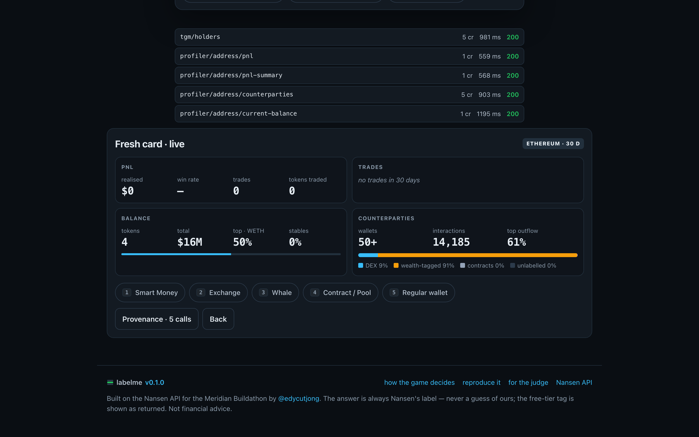
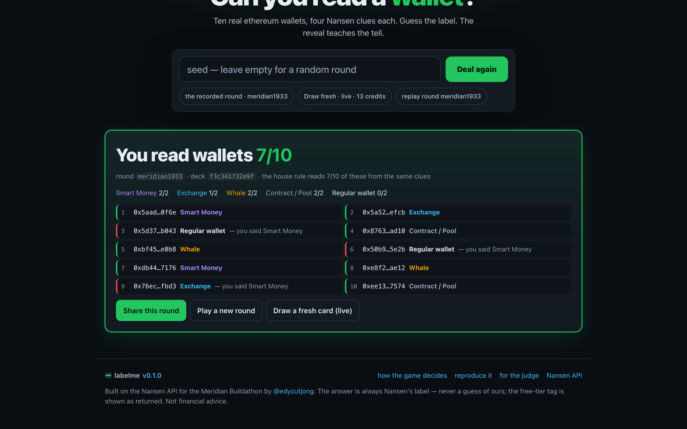
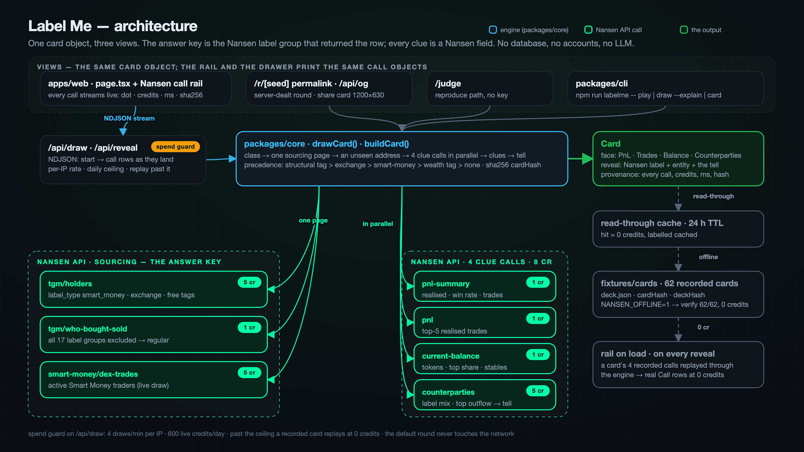
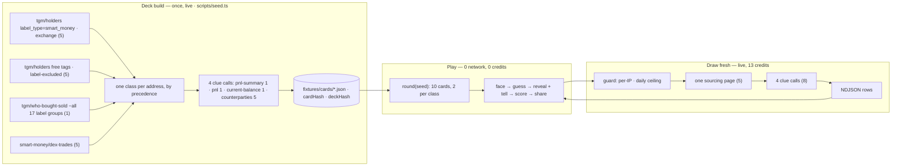

<div align="center">


<h1>Label Me 🃏</h1>
<p><em>Ten real wallets. Guess the Nansen label.</em></p>



<p>Every clue on a card is a Nansen field. Every answer is Nansen's own label group. The house rule that reads the clues is a page of arithmetic; <code>npm run verify</code> replays all 62 recorded cards offline and reproduces every card hash.</p>

<br/>

[](https://labelme.edycu.dev)
[](https://labelme.edycu.dev/judge)
[](https://nansen.ai/campaigns/meridian-buildathon)

<br/>


[](LICENSE)
[](https://github.com/edycutjong/labelme/actions/workflows/ci.yml)
[](https://github.com/edycutjong/labelme/releases/latest)

</div>

---

## 📸 See it in Action



| The face | The guess | The reveal |
|---|---|---|
| 30-day PnL (realised, win rate, trades, tokens traded, top-5), top realised trades, balance profile (tokens, total, biggest position, stables), counterparty mix by label class | five chips — **Smart Money · Exchange · Whale · Contract / Pool · Regular** — keys 1–5 | Nansen's label group, the free-tier tag as returned, the entity name where the 1-credit lookup found one (🏦 Binance), and a one-line **tell** written from the card's own numbers |

Ten cards make a round; a seed makes the round shareable (`/r/meridian1933` is the recording's round — the same ten for everyone). **Draw fresh** pulls one unseen labelled wallet live from Nansen and streams the five calls as they land, credits and latency on each row. After every round the **house rule** — a deterministic reader over the same four clues — shows how many of the ten it would have read right, so there is a bar to beat.

| Face up — the player sees numbers, never a label | Draw fresh — five live Nansen calls, then the card | Score — 7/10, per class, the house rule's 7/10 next to it |
|---|---|---|
|  |  |  |

## 💡 The Problem & Solution

### The Problem

Dani has read "Smart Money is buying" in forty tweets and could not point at a Smart Money wallet if one were on screen. Explorers show raw transfers with no labels; Nansen shows the label but not the lesson; every dashboard tells you *what* labelled wallets did. Nothing trains a person to read a wallet.

### The Solution

A card game on real ethereum wallets. The face is what Nansen computes for the wallet; the player picks the label class; the reveal is Nansen's label plus the tell. The deck is built once, live, from Nansen's own label groups — `tgm/holders` with `label_type` filters gives Smart Money and exchange holders **by construction**, free-tier tags give whales and contracts, `tgm/who-bought-sold` with every label group excluded gives the honest negative ("none of Nansen's groups") — and committed as fixtures, so the default round costs 0 credits and cannot break on camera. Only "Draw fresh" is live.

## 🏗️ Architecture & Tech Stack

One card object, three views. The answer key is the Nansen label group that returned the row; every clue is a Nansen field. No database, no accounts, no LLM.

<p align="center"></p>

<details>
<summary><b>Mermaid source</b> — expand to see the diagram as text (renders on GitHub)</summary>



</details>

| Layer | Choice | Why |
|---|---|---|
| Engine | `packages/core` — TypeScript strict, zod-validated Nansen responses, pure functions for clues · tell · reader · rounds | one engine for CLI and web; every decision testable |
| CLI | `packages/cli` — `npm run labelme -- play \| draw \| card` | the reproduce path in [JUDGE.md](JUDGE.md) |
| Web | `apps/web` — Next.js 15, React 19, plain CSS, streaming NDJSON route | Vercel; the recording shows real calls landing |
| Data | Nansen API v1 (`apikey` header), 9 endpoints | the answer key and every clue |
| Cache | read-through disk cache (CLI), memory per instance (web), 24 h TTL, `NANSEN_OFFLINE=1` replay | cached calls recorded at 0 credits; `verify` never touches the network |

Full detail: [ARCHITECTURE.md](ARCHITECTURE.md) · the rule doc: [docs/RULES.md](docs/RULES.md).

## 🏆 Nansen Integration

| Nansen call | Credits | What it decides in Label Me |
|---|---|---|
| `tgm/holders` `label_type: smart_money` + `include_smart_money_labels` (Fund, Smart Trader tiers) | 5 | Smart Money cards exist at all — the answer key by construction, no premium call |
| `tgm/holders` `label_type: exchange` / `public_figure` | 5 | the Exchange answer key; Public Figure members are excluded from every other class |
| `tgm/holders` plain page free tags (Token Billionaire, Liquidity Pool, MultiSig, Proxy…) and the label-excluded page | 5 | the Whale and Contract/Pool answer keys |
| `tgm/who-bought-sold` with all 17 `LabelType` values excluded | 1 | the Regular class: "Nansen put this wallet in none of its label groups" |
| `smart-money/dex-trades` | 5 | active Smart Money traders (the live draw's Smart Money source) |
| `profiler/address/pnl-summary` · `profiler/address/pnl` | 1 · 1 | the PnL and Trades clues (realised, win rate, trades, tokens traded, top tokens) |
| `profiler/address/current-balance` | 1 | the Balance clue (tokens, total, biggest position, stable share) |
| `profiler/address/counterparties` (`counterparty_address_label[]`) | 5 | the Counterparties clue — class mix, top-outflow share — and most of the tell |
| `profiler/address/transactions` + `transaction-with-token-transfer-lookup` | 1 + 1 | entity names on the reveal (🏦 Luno: Wallet) — and they outrank the free tag: a "MultiSig"-tagged wallet Nansen marks 🏦 is an exchange |

**See the calls, not just the table:** the web page carries a live **Nansen call rail** on the right — every call the page makes streams in as it happens (pending → live/cached/error dot, `POST endpoint`, params, credits, ms, sha256 of the response), the same `Call` objects the provenance drawer prints and `--explain` lists in the CLI; on load it already shows the example card's four recorded calls, replayed at 0 credits.

### Why only Nansen

Take Nansen out and the game has no answer key and no clues: you would need a Smart Money classifier, an exchange/entity label database, a pool-and-contract detector, a PnL engine with cost basis, and a labelled index of the *other* side of every transfer — five systems — before a single card could be dealt. Every number the player sees is one of the response fields above; every reveal is the label group that returned the row.

## 📊 Engineering Rigor

| | |
|---|---|
| **Deck** | 62 cards on ethereum (12 Smart Money · 16 exchange · 12 whale · 10 contract/pool · 12 regular), recorded live by `scripts/seed.ts`; every raw response committed; `fixtures/dropped.json` names the 101 addresses dropped and why |
| **Determinism** | `npm run verify` replays all 62 cards offline — same clues, same tell, same `cardHash` — zero network, zero credits |
| **Tests** | **134 tests** (vitest) · **12,000 property cases** (fast-check: the reader is total over any clues, the tell is one line, the hash ignores time and the reader, a round is deterministic and URL-safe, extractors never throw) · a route boundary suite: garbage never reaches Nansen |
| **Bench** | 10 live draws: **cold p50 2.1 s · p95 2.6 s · warm 1 ms · 12.2 credits per draw · 0 failed**; the house rule read 7/10 fresh cards (out-of-sample) — [docs/BENCH.md](docs/BENCH.md) |
| **House rule** | 50/62 on the deck (in-sample; thresholds set on this deck and printed in [docs/RULES.md](docs/RULES.md)) |
| **Spend guard** | `/api/draw` is the only route that spends: 4 draws per minute per IP, 600 credits per UTC day per instance, then a labelled deck replay |

### Honesty

- The default round is a **labelled replay** of live-recorded cards ("EXAMPLE · recorded 2026-09-18 · 0 credits"); the live path is "Draw fresh" and the CLI's `draw`.
- The reveal shows the free-tier `address_label` **as returned** (Token Millionaire, MultiSig, an ENS name) next to the class — never an invented entity name.
- The house rule is a rule, not a model; its thresholds were set on the deck and the bench reports it on cards it never saw.

### Honest limits (5)

1. Free-tier labels are wealth/structural tags, not entity names; entity names appear only where the 1-credit tx-lookup found one (23 of 62 cards).
2. "Regular" is a negative — none of the 17 label groups — not a positive identification.
3. Public Figure was dropped after the spike: a person label is not a wallet behaviour.
4. A dormant Smart Money wallet is unreadable from cheap clues; the deck keeps only active ones (≥ 5 trades in 30 days), a live draw can still deal one and says so.
5. Ethereum only; the 30-day window is a snapshot recorded 2026-09-18.

## 🚀 Getting Started

### Prerequisites

- Node.js ≥ 20
- A Nansen API key for the live paths only — https://app.nansen.ai/api (the deck, the tests and `verify` need none)

### Installation

```bash
git clone https://github.com/edycutjong/labelme && cd labelme
npm install
```

### Run it in under 10 minutes

| Step | Command | Measured (clean clone, 2026-09-18) |
|---|---|---|
| Play the recording's round with the answer key (0 credits) | `npm run labelme -- play --seed meridian1933 --answers` | 1 s |
| Play interactively in the terminal | `npm run labelme -- play` | — |
| Replay the deck offline | `npm run verify` | 1 s |
| Draw one unseen wallet live (13 credits) | `export NANSEN_API_KEY=nsn_… && npm run labelme -- draw --explain` | 1–3 s |
| The web app | `npm run dev` → http://localhost:3200 | first page 4 s |

Clone + install + first round: **7 s** of machine time; with `verify` and the 134 tests **11 s** (timed clean clone from GitHub, re-measured 2026-09-19 — clone 2 s · install 5 s · first round < 1 s · verify 1 s · tests 3 s; 6 s / 9 s on 2026-09-18).

## 🧪 Testing & CI

```bash
npm test                 # 134 vitest tests, no key, no network (≈ 4 s)
npm run verify           # 62/62 cards reproduced offline
npm run reader           # the house rule's confusion matrix on the deck
npm run typecheck && npm run lint && npm run format:check
npm run check            # submission readiness: README claims vs the tree, kitchen/secret scan

# live (spends credits)
npm run bench -- --runs 10   # ~130 credits → docs/BENCH.md
npm run seed -- --dry        # gather + resolve candidates only (≈ 100 credits of sourcing pages, cached after)
```

CI/CD (`.github/workflows/ci.yml`): quality (format · lint · typecheck · tests + coverage · verify · readiness) ∥ security (TruffleHog full history · npm audit · licenses) → build → e2e (Playwright, keyless) → deploy gate → **production deploy** on push to `main` (`vercel build` on the runner, `vercel deploy --prebuilt --prod`, then the stable alias is re-pointed). No key in CI — every stage before the deploy is offline; the deploy needs only `VERCEL_TOKEN`.

Releases: semantic versions cut automatically from Conventional Commits (`release.yml` after a green pipeline on `main` — `feat:` minor, `fix:`/`perf:` patch, `!` major; bumps every `package.json`, tags, publishes with generated notes). `npm run release` (`--dry-run` to preview) runs the same algorithm locally when Actions is unavailable. The footer version on the site is the released `package.json` version.

## 📁 Project Structure

```
packages/core/src   client.ts cache.ts nansen.ts classes.ts clues.ts tell.ts reader.ts card.ts sources.ts round.ts draw.ts fixtures.ts
packages/cli/src    cli.ts render.ts                 npm run labelme -- play | draw | card
apps/web            app/ (page, r/[seed], judge, api/round, api/reveal, api/draw, api/og) · components/ · lib/ (deck, guard, site, proof)
scripts             seed.ts verify.ts reader.ts bench.ts spike.ts check_submission_readiness.ts
fixtures            cards/*.json (62) · deck.json · dropped.json
docs                RULES.md BENCH.md DX-REPORT.md screenshots/ assets/
```

## 📽️ Demo Materials

- [DEMO.md](DEMO.md) — verbatim CLI output of the recording's round and one live draw, bench numbers, reproduce steps
- [JUDGE.md](JUDGE.md) — the claim, the 30-second path, receipts, honest limitations (mirrors `/judge`)
- [docs/DX-REPORT.md](docs/DX-REPORT.md) — what was rough in the Nansen API and what we wish existed

## 📄 License

MIT — see [LICENSE](LICENSE). Built by [@edycutjong](https://x.com/edycutjong) for the Nansen Meridian Buildathon.
